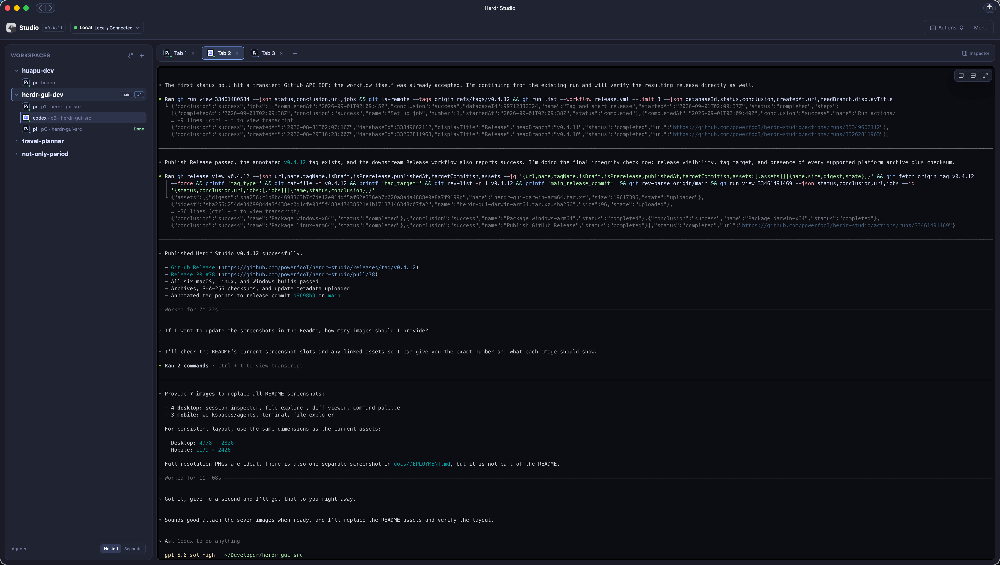
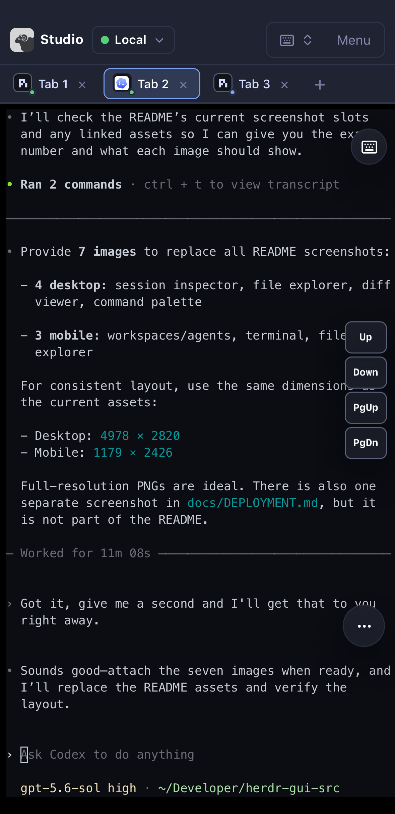

# SHPRD

A minimal **web client** for [Herdr](https://herdr.dev). It connects to a
running Herdr server through its local socket API and provides a browser and PWA
dashboard for workspaces, tabs, panes, terminals, agents, files, and diffs.

> **Compatibility:** Existing installations may still use legacy `herdr-gui`
> binary, `HERDR_GUI_*` configuration and environment names, cookies, update
> assets, archives, paths, and service names. New installs use SHPRD names shown
> below.

## Documentation

The experimental SHPRD Rust host and Dioxus shell are source-only alternatives;
the Bun bridge remains the default. See [native component boundaries](./docs/ARCHITECTURE.md#experimental-native-components)
and [native development commands](./docs/DEPLOYMENT.md#experimental-native-development).

- [Project website](https://Nebuless.github.io/shprd/)
- [Hands-on tutorial](https://Nebuless.github.io/shprd/tutorial/)
  ([Markdown](./docs/TUTORIAL.md)): first steps, review workflows, mobile, and
  private remote access with Tailscale, SSH, or Tailcat.
- [Feature tour and keyboard shortcuts](./FEATURES.md)
- [Installation, configuration, services, and builds](./docs/DEPLOYMENT.md)
- [Architecture and implementation](./docs/ARCHITECTURE.md)
- [Security guidance](./SECURITY.md)
- [Contributing](./CONTRIBUTING.md)

## Screenshots

### Desktop

[![Desktop workspace with a live terminal and session history][desktop-session]][desktop-session]

Workspace terminal with live agent session history.

<!-- markdownlint-disable MD033 -->

<table width="100%">
  <thead>
    <tr>
      <th width="33.33%" align="center">File explorer</th>
      <th width="33.33%" align="center">Diff viewer</th>
      <th width="33.33%" align="center">Full terminal</th>
    </tr>
  </thead>
  <tbody>
    <tr>
      <td width="33.33%" align="center" valign="top">
        <a href="./docs/images/shprd-desktop-file-explorer.png"></a>
      </td>
      <td width="33.33%" align="center" valign="top">
        <a href="./docs/images/shprd-desktop-diff-viewer.png"></a>
      </td>
      <td width="33.33%" align="center" valign="top">
        <a href="./docs/images/shprd-desktop-terminal.png"></a>
      </td>
    </tr>
  </tbody>
</table>

### Mobile

<table width="100%">
  <thead>
    <tr>
      <th width="33.33%" align="center">Changed files</th>
      <th width="33.33%" align="center">Full terminal control</th>
      <th width="33.33%" align="center">File viewer</th>
    </tr>
  </thead>
  <tbody>
    <tr>
      <td width="33.33%" align="center" valign="top">
        <a href="./docs/images/shprd-mobile-changed-files.png"></a>
      </td>
      <td width="33.33%" align="center" valign="top">
        <a href="./docs/images/shprd-mobile-terminal.png"></a>
      </td>
      <td width="33.33%" align="center" valign="top">
        <a href="./docs/images/shprd-mobile-file-viewer.png"></a>
      </td>
    </tr>
  </tbody>
</table>

<!-- markdownlint-enable MD033 -->

Click any screenshot to open the full-resolution image.

[desktop-session]: ./docs/images/shprd-desktop-session-history.png

## Quick start

Herdr must already be installed and running. Install the latest standalone
SHPRD binary with:

```bash
# Leave empty for latest; set SHPRD_VERSION=X.Y.Z for a specific version (no v prefix).
curl -fsSL \
  https://github.com/Nebuless/shprd/releases/latest/download/install-shprd.sh \
  | SHPRD_VERSION= sh
```

The installer stages downloads in `~/.local/share/shprd/tmp`, then removes
staged files after installation. Set `SHPRD_TEMP_DIR` to use another temporary
staging root; if it is full or unavailable, the installer falls back to the
home-owned default. Installed binaries live at `~/.local/bin/shprd`.

Make sure `~/.local/bin` is in `PATH`, then start the application:

```bash
shprd
```

Open the URL printed by the process. On Windows, download the matching x64 or
ARM64 archive from the
[latest release](https://github.com/Nebuless/shprd/releases/latest)
instead of running the script. See the
[deployment guide](./docs/DEPLOYMENT.md) for checksum verification,
fixed-version installation, authentication, remote connections, updates, and
user-service setup.

## Install as a PWA

For day-to-day use, install SHPRD as a standalone web app after starting
and authenticating with `shprd`:

- **iPhone or iPad (Safari):** **Share** -> **Add to Home Screen**.
- **macOS (Safari 17+):** **File** -> **Add to Dock**.
- **Chrome or Edge:** choose **Install app** from the browser menu.

The installed app still requires the `shprd` process to be running and
reachable; PWA mode does not provide offline access.

## Android

Download the signed `shprd-vX.Y.Z-android.apk` and matching `.sha256` file
from the [latest release](https://github.com/Nebuless/shprd/releases/latest).
The APK is a remote client: after installation, enter the HTTP(S) origin of a
running SHPRD bridge reachable from the device. It does not start a local
bridge or connect to a bridge bound only to the phone's loopback address.

## Development

Source builds require [Bun](https://bun.sh) 1.4 or newer. Start the bridge and
frontend in separate terminals:

```bash
bun install
(cd web && bun install)
(cd server && bun install)

bun run dev:server
bun run dev:web
```

Open <http://localhost:5173>. See [CONTRIBUTING.md](./CONTRIBUTING.md) for the
validation commands and pull request guidelines.

## Security

SHPRD can control terminal sessions and modify workspace files. Keep the
default loopback binding unless you understand the trust boundary. Read
[SECURITY.md](./SECURITY.md) before exposing the service to another device.

## License

The project code is available under the [MIT License](./LICENSE). Bundled fonts
and brand assets retain their original terms; see
[THIRD_PARTY_NOTICES.md](./THIRD_PARTY_NOTICES.md).
