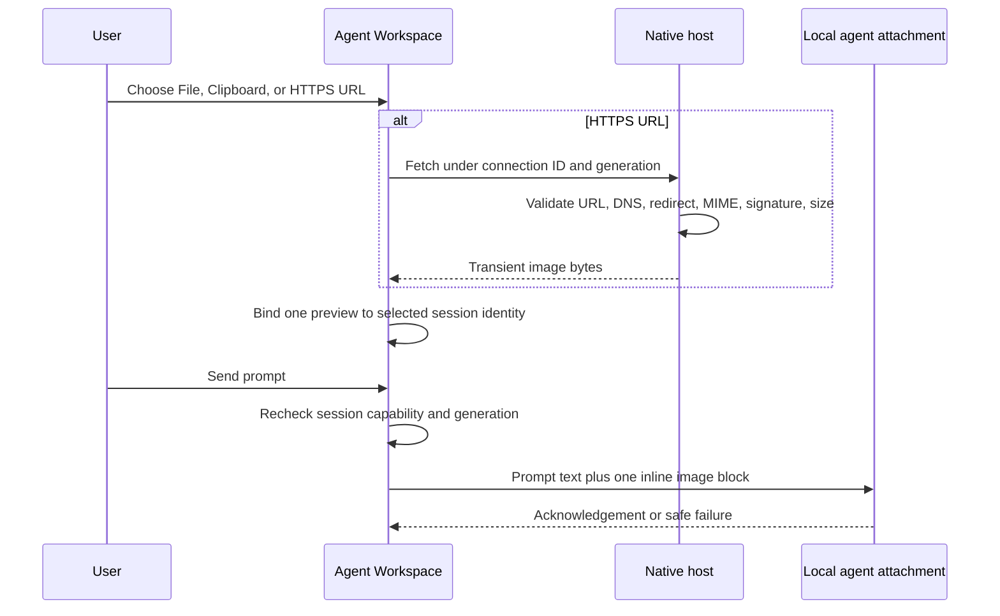

# Agent Chat Image Sources - Plan

## Goal Capsule

- **Objective:** Let a desktop SHPRD user attach one image to an agent-chat message from a file, clipboard, or direct image URL without exposing host filesystem paths or private network resources.
- **Product authority:** This plan covers structured Agent Workspace chat. Terminal composer image-path behavior remains outside active scope.
- **Open blockers:** None.

---

## Product Contract

### Summary

Agent Workspace gains an image control beside its message composer. It opens a compact source menu for choosing a file, pasting a clipboard image, or entering a direct public HTTPS image URL. The selected image appears as one removable preview and reaches a capable attached agent with submitted prompt text.

### Problem Frame

The existing terminal flow can upload image bytes and insert a temporary host path into terminal input, but structured agent chat has only a text composer. A browser cannot safely resolve a pasted absolute local path, so the product needs explicit user-granted file and clipboard access plus a constrained URL route.

### Key Decisions

- **Agent-chat first.** Structured Agent Workspace is active scope; terminal composer redesign is not. Governs R1, R7.
- **Compact source menu.** One image icon exposes Files, Clipboard, and Image URL without a separate attachment dialog. Governs R2.
- **Three explicit image sources.** File picker, clipboard image, and direct image URL are supported. (session-settled: user-directed — chosen over Files-only: user selected all three.) Governs R2, R3, R4.
- **Direct public HTTPS URLs only.** The product fetches an image resource, not an arbitrary web page or host-network address. (session-settled: user-directed — chosen over host-network URLs: avoids private-service access.) Governs R4, R6.
- **One image per message.** Replacing or removing the preview is required before sending; multiple images defer. Governs R5.

### Requirements

**Agent-chat control**

- R1. Desktop Agent Workspace shows an image attachment control only for a selected, connected session that advertises image-prompt capability.
- R2. Activating the control opens a compact menu with Choose file, Paste clipboard image, and Image URL actions.
- R3. Choose file uses browser-native file selection and accepts a supported image without asking the user to type or paste an absolute local path.
- R4. Image URL accepts only a direct, public HTTPS image resource and rejects web-page URLs, HTTP URLs, localhost, LAN, Tailscale, private IP ranges, and redirects to any excluded destination. URL retrieval validates each resolved destination immediately before connecting, pins approved public targets for every hop, and rejects re-resolution or connection attempts to non-public destinations.
- R5. Each source produces one visible image preview with filename or source label, remove action, upload state, and failure state; choosing another image replaces it. Send is unavailable while image preparation is pending, and a failure retains the text draft with Remove, Replace, and source-appropriate Retry actions.
- R6. Clipboard access happens only after the explicit Paste clipboard image action. Denial, unavailable API, or absent image leaves the draft and file option usable.
- R11. The attachment menu, URL entry, preview, removal controls, and recovery actions are keyboard operable with visible focus restoration. Controls have accessible names, and preview, validation, preparation, and failure state changes are announced to assistive technology.

**Agent delivery and safety**

- R7. Sending a prompt with a preview delivers prompt text and image content together to the currently selected, capable local agent session. A preview is bound to its selected session identity; changing or reconnecting the session clears it or requires explicit reattachment, and capability and locality are revalidated immediately before delivery.
- R8. The interface never converts an agent-chat image into a terminal path, raw filesystem path, or implicit terminal input.
- R9. Unsupported agents, remote attachment profiles, offline sessions, unsupported MIME types, oversized images, malformed responses, and failed URL retrieval fail before agent delivery with a clear recovery path.
- R10. Image bytes, absolute source paths, attachment credentials, and URL query secrets are not retained in browser storage, session metadata, logs, or displayed error text.

### Actors

- A1. **Desktop SHPRD user:** chooses one image source, reviews or removes the preview, and sends the message.
- A2. **Attached local agent session:** receives the image as native image content only when it advertises support.
- A3. **SHPRD host:** retrieves permitted image URLs and enforces destination, type, size, and lifecycle boundaries.

### Key Flows

- F1. File attachment
  - **Trigger:** A1 selects Choose file.
  - **Actors:** A1, A2.
  - **Steps:** Native picker returns an image; workspace shows preview; A1 sends prompt; supported current session receives text and image together.
  - **Outcome:** A1 sees attachment state before agent delivery.
  - **Covers R1, R2, R3, R5, R7, R8.**

- F2. Clipboard attachment
  - **Trigger:** A1 selects Paste clipboard image.
  - **Actors:** A1, A2.
  - **Steps:** Workspace reads clipboard under user gesture; image becomes preview; denial or no image reports recoverable state; A1 can instead choose a file.
  - **Outcome:** No background clipboard access and no lost draft.
  - **Covers R2, R5, R6, R7.**

- F3. URL attachment
  - **Trigger:** A1 selects Image URL and submits a URL.
  - **Actors:** A1, A3, A2.
  - **Steps:** SHPRD validates public HTTPS destination and direct image response; valid image becomes preview; A1 sends prompt; capable session receives it.
  - **Outcome:** URL source cannot access private or page content.
  - **Covers R2, R4, R5, R7, R9, R10.**

### Acceptance Examples

- AE1. **Covers R2, R3, R5.** Given a capable connected agent session, when user chooses a PNG through file picker, then one preview appears and user can remove or replace it before Send.
- AE2. **Covers R6.** Given clipboard access is denied, when user selects Paste clipboard image, then draft remains unchanged, no image reaches agent, and Choose file stays available.
- AE3. **Covers R4, R9.** Given an image URL redirects or resolves to a private address before a connection attempt, when user submits it, then SHPRD rejects it before retrieval and preview is not created.
- AE4. **Covers R5, R7, R8.** Given image preparation is pending, when user tries to Send, then Send is unavailable; after preparation succeeds, agent receives native image content with prompt text and no terminal path is injected.
- AE5. **Covers R1, R9.** Given an unsupported, remote, or offline agent session, when user opens chat, then attachment control is unavailable and no source request begins.
- AE6. **Covers R7.** Given a preview for one capable session, when user switches or reconnects to another session, then the preview is cleared or requires explicit reattachment before Send.
- AE7. **Covers R11.** Given keyboard-only or assistive-technology use, when user opens source menu, selects an image, or receives failure, then named controls, restored focus, and status announcement allow completion or recovery.

### Scope Boundaries

**Deferred for later**

- Several images in one message.
- Mobile attachment UX after desktop proof.
- URL authentication, page scraping, and image extraction from web documents.

**Outside this product's identity**

- Arbitrary browser access to local filesystem paths.
- Private-network, localhost, LAN, or Tailscale URL retrieval.
- Replacing terminal composer image-path behavior.

### Dependencies and Assumptions

- A capable local agent attachment can accept native image content alongside text; agents that cannot do this remain explicitly unsupported.
- Browser file selection and clipboard access remain user-granted browser actions.
- Public HTTPS image retrieval can enforce destination policy across every redirect and each connection attempt before any private-network connection.

### Sources and Research

- Existing terminal image source behavior and connection-scoped upload contract: `web/src/components/TerminalComposer.tsx`, `web/src/components/TerminalView.tsx`, `web/src/terminalImageUpload.ts`.
- Current text-only Agent Workspace and attachment command boundary: `web/src/components/AgentWorkspace.tsx`, `web/src/agentClient.ts`, `integrations/pi/attachment.ts`.
- Native agent attachment locality boundary: `crates/shprd-host/src/host.rs`.
- Browser clipboard access and file-path limitations: https://developer.mozilla.org/en-US/docs/Web/API/ClipboardEvent/clipboardData and https://developer.mozilla.org/en-US/docs/Web/API/Clipboard_API.

---

## Planning Contract

### Key Technical Decisions

- KTD1. **Carry one validated image inline with its prompt.** The agent command carries text and one base64 image block; no terminal path, temporary file path, URL, or persisted handle crosses the agent protocol. Governs R7, R8, R10.
- KTD2. **Advertise image capability per runtime.** Atomic advertises support only after a real adapter test sends native image content; Senpi advertises no support until its installed API contract is inspected and covered. The UI never infers support from agent name. Governs R1, R7, R9.
- KTD3. **Fetch URL images in native host under current local connection lease.** A scoped native endpoint validates each HTTPS hop, resolves and pins only public destinations, then returns transient validated image bytes. Terminal upload routes remain unchanged. Governs R4, R7, R8, R9, R10.
- KTD4. **Use one decoded image limit.** File, clipboard, URL, browser conversion, Rust socket framing, and PI attachment validation enforce the existing 25 MiB decoded image cap; the protocol wire cap accommodates one base64-encoded image plus command envelope. Governs R5, R7, R9.
- KTD5. **Treat session identity and transport generation as attachment ownership.** Browser attachment state clears on selection, disconnect, loss, scope replacement, and stale completion. The native request never retries after cancellation or lease retirement. Governs R5, R7, R9, R10.

### High-Level Technical Design

### Constraints and Dependencies

- `crates/shprd-host/src/host.rs`, `crates/shprd-workspace/src/files.rs`, and `crates/shprd-workspace/src/lib.rs` were already modified before this feature. U2 must not alter their unrelated changes; approval to integrate the host routing file is required before U2 writes.
- U2 adds a direct HTTP client dependency with TLS, redirect control, and pinned-DNS connection support. It must not reuse terminal upload APIs or SSH transfer code.
- URL attachment depends on U2. File and clipboard depend on U1 only.
- Senpi image support is deferred until its installed runtime API has executable evidence. This is capability-gated behavior, not a fallback to path-based terminal upload.

---

## Implementation Units

### U1. Add capability-negotiated image prompt protocol

**Goal:** Deliver one validated image with prompt text to an image-capable local adapter without exposing source paths or secrets.

**Requirements:** R1, R7, R8, R9, R10; covers AE4, AE5, AE6.

**Dependencies:** None.

**Files:** `integrations/pi/attachment.ts`, `integrations/pi/atomic.ts`, `integrations/pi/senpi.ts`, `integrations/pi/attachment.test.ts`, `crates/shprd-agent/src/lib.rs`, `crates/shprd-agent/tests/socket.rs`, `web/src/agentClient.ts`, `web/src/agentClient.test.ts`.

**Approach:**
1. Extend native session state and browser parsing with explicit `capabilities.image_prompt`.
2. Extend prompt command validation for one optional image block with decoded-byte and base64 validation under KTD1 and KTD4.
3. Make Atomic transform the validated block into its native text-plus-image content API only after adapter-level proof; leave Senpi capability false and text behavior unchanged.
4. Preserve generation, epoch, abort, attachment-loss, and draft-retention rules under KTD5.

**Patterns to follow:** Existing `AgentWorkspaceClient.command` acknowledgment guards, native socket framing in `shprd-agent`, and adapter request validation in `integrations/pi/attachment.ts`.

**Test scenarios:**
- Covers AE4. Atomic receives one exact text-and-image native content sequence after a valid prompt command.
- Senpi rejects image prompt before runtime dispatch and continues accepting text-only prompts.
- Missing capability, unsupported MIME, invalid base64, empty payload, or image over decoded limit fails without echoing image data.
- Session capability reaches browser transport and a stale selected-session reply cannot clear a newer draft or attachment.
- Remote, lost, aborted, or retired-generation request never causes image delivery or automatic replay.

**Verification:** Adapter socket, Rust socket, browser transport, and host agent-control tests prove command shape, capability gating, cancellation, and local-profile rejection.

### U2. Add guarded connection-scoped URL image retrieval

**Goal:** Return one validated direct-public-HTTPS image to the browser without permitting SSRF, terminal-path creation, or persistence.

**Requirements:** R4, R7, R8, R9, R10; covers F3, AE3, AE5.

**Dependencies:** U1 for final browser capability and byte-limit contract; host routing-file ownership approval.

**Files:** `crates/shprd-host/Cargo.toml`, `crates/shprd-host/src/image_fetch.rs`, `crates/shprd-host/src/host.rs`, `crates/shprd-connections/src/http.rs`, `crates/shprd-host/src/host.rs` tests, `crates/shprd-host/tests/agent_control.rs` when route locality needs integration proof.

**Approach:**
1. Add one authenticated connection-scoped fetch endpoint to the native route registry, with no unscoped compatibility alias.
2. Resolve current lease and reject stale or remote profiles before DNS work.
3. Parse only credential-free, fragment-free standard-port HTTPS URLs and reject local lexical names, private/special addresses, mixed DNS results, proxy use, and redirect loops.
4. Resolve and pin a public destination for each hop; manually follow at most three redirects with a fresh validated connection decision per hop.
5. Stream only final `200 OK` supported-image responses under KTD4, validate declared and actual sizes plus byte signatures, then return in-memory bytes with `no-store` and sanitized failures.

**Patterns to follow:** Native `HttpEndpoint` route registry, profile lease resolution, agent-control local-profile guard, and bounded file transfer readers. Do not use `upload_terminal_image` or server-side Bun upload code.

**Test scenarios:**
- Covers AE3. HTTP, credentials, fragments, alternate ports, localhost, `.local`, `.internal`, `.ts.net`, private, special-use, mixed DNS, and proxy paths fail before upstream request.
- Private redirect, malformed location, redirect loop, and fourth redirect fail before response bytes reach browser.
- Missing, page, SVG, unsupported, mismatched, oversized, or truncated image response fails without source URL or upstream body disclosure.
- Valid PNG, JPEG, GIF, WebP, BMP, ICO, and AVIF bytes return expected MIME, `no-store`, and no source metadata.
- Stale generation and remote profile reject before DNS lookup; authenticated scoped route returns current connection identity headers.

**Verification:** Focused host and routing tests prove no private connection path, byte/MIME checks, locality, generation, and response hygiene; Rust formatting, Clippy, and host tests stay clean.

### U3. Build session-bound Agent Workspace image composer

**Goal:** Let a capable desktop agent session prepare, inspect, replace, remove, and send one file, clipboard, or host-fetched URL image accessibly.

**Requirements:** R1, R2, R3, R5, R6, R7, R9, R10, R11; covers F1, F2, AE1, AE2, AE4, AE5, AE6, AE7.

**Dependencies:** U1; U2 for Image URL source.

**Files:** `web/src/components/AgentWorkspace.tsx`, `web/src/components/AgentWorkspace.css`, `web/src/agentImageAttachment.ts`, `web/src/agentImageAttachment.test.ts`, `web/src/agentClient.ts`, `web/src/agentClient.test.ts`.

**Approach:**
1. Add one session-bound attachment slot separate from global request state and errors.
2. Add compact source menu, native file input, gesture-scoped clipboard read, URL entry, safe source labels, one preview, and source-specific recovery actions.
3. Keep image data ephemeral in browser memory; revoke preview URLs on replacement, removal, session change, loss, scope replacement, and unmount.
4. Disable send while preparation is pending; recheck current session capability, locality, identity, and transport generation before forwarding one image under KTD1.
5. Add keyboard interaction, focus restoration, named controls, and state announcements under R11.

**Patterns to follow:** Existing composer action/focus styles, `TerminalComposer` file-input reset only, `AgentWorkspaceClient` epoch and acknowledgement guards, and `createAgentTransport` generation filtering. Do not import terminal upload or terminal paste helpers.

**Test scenarios:**
- Covers AE1. Image file produces one safe preview; replace and remove revoke old browser URL and leave text draft intact.
- Covers AE2. Clipboard denial, unavailable API, or no image reports recovery without reading clipboard in the background or losing draft.
- URL syntax rejects non-HTTPS before host request and hides query/fragment from labels and errors.
- Covers AE4. Send remains disabled while preparation is pending and sends text plus one image only when current session is capable and ready.
- Covers AE6. Session selection, connection loss, scope replacement, reconnect, and stale preparation completion clear the matching attachment but retain current draft semantics.
- Covers AE7. Menu, URL entry, preview, recovery, Escape, and focus return work through keyboard and announce state changes.

**Verification:** Browser helper and client state tests cover source lifecycle and races; web typecheck and production build compile the accessible composer.

---

## Verification Contract

- Run focused PI attachment, native agent socket, host route, connection-routing, and Agent Workspace client/helper tests for U1-U3.
- Run Rust formatting and strict Clippy for changed native crates.
- Run web typecheck, affected Bun tests, and production web build.
- Run full repository precommit gate before local commit.
- Manually QA live Agent Workspace with an Atomic session: file, clipboard denial, valid public URL, private-redirect rejection, replacement/removal, session switch, unavailable Senpi control, and keyboard-only recovery.

---

## Definition of Done

- U1 advertises and delivers one image only through tested image-capable adapter support, never terminal paths.
- U2 enforces public HTTPS retrieval before each connection and leaves no source data, temporary file, or terminal side effect.
- U3 gives capable desktop sessions all three sources with one accessible session-bound preview and deterministic recovery.
- Unsupported, remote, lost, stale, cancelled, oversized, malformed, and unsafe inputs fail before native image delivery with drafts preserved.
- Targeted checks, repository gate, and manual QA pass; abandoned attempts and debug exposure are absent from changed files.
